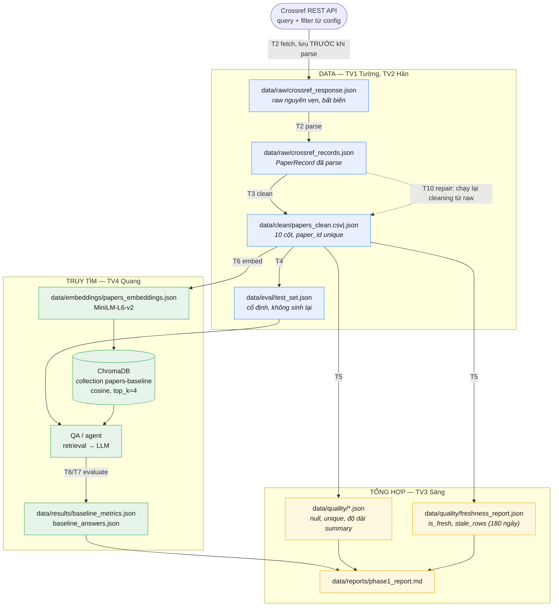
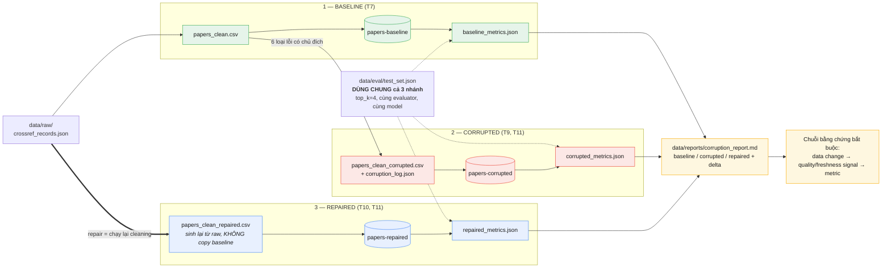

# Kế hoạch buổi K4 chiều 06/08/2026 — nhóm 4 người

> **Thời lượng:** 4 giờ (3h45 làm việc + 15 phút nghỉ).
> **Mục tiêu bắt buộc:** baseline chạy end-to-end → corrupt có kiểm soát → repair từ raw → comparison report khớp artifact thật.
> **Lý thuyết (vì sao làm từng bước):** [THEORY.md](THEORY.md) — đọc trước CP0 nếu chưa nắm RAG/observability.

## 1. Thông tin nhóm

Vai trò chia theo ba khối của pipeline RAG: **DATA** (đưa dữ liệu vào và làm sạch) → **TRUY TÌM** (embed, index, hỏi–đáp, chấm điểm) → **TỔNG HỢP** (quality, freshness, report, so sánh).

| Mã | Họ tên | MSSV | Khối | Vai trò | Nhánh |
| --- | --- | --- | --- | --- | --- |
| TV1 | Cao Các Tường | 2A202601236 | DATA | Nguồn & raw ingestion | `feat/data-source` |
| TV2 | Lưu Nguyễn Ngọc Hân | 2A202601386 | DATA | Clean, test set & corruption | `feat/data-model` |
| TV3 | Trần Quang Sáng | 2A202601446 | TỔNG HỢP | Quality, freshness & report | `feat/synthesis` |
| TV4 | Nguyễn Xuân Quang | 2A202601776 | TRUY TÌM | Embedding/index, evaluation & tích hợp pipeline | `feat/retrieval-integration` |

- **DATA (TV1 + TV2):** sở hữu mọi thứ trước khi dữ liệu vào vector store — raw snapshot, clean schema, test set, và cả bản corrupted/repaired vì đó cũng là biến đổi dữ liệu.
- **TRUY TÌM (TV4):** sở hữu mọi thứ giữa clean data và câu trả lời — embedding, ChromaDB collection, agent/QA, `evaluate_pipeline`; đồng thời là người ráp hai entrypoint, điều phối merge và **chủ trì tổng hợp `group_report.md`**.
- **TỔNG HỢP (TV3):** sở hữu mọi thứ sau khi có số — quality checks, freshness, `phase1_report.md`, `corruption_report.md`; đóng góp phần số liệu/nhận xét cho `group_report.md` do TV4 chủ trì.

Khi pipeline lỗi ở khối nào, owner khối đó chẩn đoán và bàn giao bản đã xác minh, không đẩy hết cho TV4.

## 1.1 Sơ đồ pipeline

### A. Luồng dữ liệu và ranh giới owner

Đọc theo mũi tên: mỗi node là **một artifact có thật trên đĩa**. Ranh giới giữa hai khối màu chính là handoff — chỗ dễ đổ lỗi nhất nếu không chốt schema trước.



**Điều phải nhớ từ sơ đồ A:** `data/raw/` là bất biến và là **nguồn duy nhất** để repair (mũi tên nét đứt). Mọi path lấy từ `Paths` trong `src/core/config.py`, không hard-code.

### B. Ba trạng thái so sánh — biến duy nhất là chất lượng dữ liệu



**Điều phải nhớ từ sơ đồ B:** ba nhánh chỉ khác nhau ở **chất lượng dữ liệu**; test set, `top_k`, evaluator và model phải giống hệt nhau, nếu không thì delta vô nghĩa. Ba collection tách tên vì `LocalEmbeddingIndex.build` xóa collection trùng tên trước khi tạo lại — dùng chung tên là mất baseline.

## 2. Hiện trạng workspace (đã kiểm tra 06/08)

- **12 hàm `TODO(student)` / `NotImplementedError` trong 8 file** — đây là toàn bộ khối lượng code phải viết:

  | File | Hàm chưa làm | Khối | Owner |
  | --- | --- | --- | --- |
  | `src/ingestion/crossref.py` | `parse_crossref_payload`, `fetch_source_records`, `load_raw_records` | DATA | TV1 |
  | `src/ingestion/cleaning.py` | `build_clean_dataframe` | DATA | TV2 |
  | `src/evaluation/testset.py` | `build_test_set` | DATA | TV2 |
  | `src/ingestion/corruption.py` | `corrupt_clean_dataframe` | DATA | TV2 |
  | `src/observability/quality.py` | `run_data_quality_checks`, `build_freshness_report` | TỔNG HỢP | TV3 |
  | `src/observability/reporting.py` | `generate_phase1_report`, `generate_corruption_report` | TỔNG HỢP | TV3 |
  | `src/pipelines/phase1.py` | `main` | TRUY TÌM | TV4 |
  | `src/pipelines/corruption_flow.py` | `main` | TRUY TÌM | TV4 |

- Đã có sẵn, **không viết lại**: `src/core/config.py` + `utils.py`, `src/retrieval/*` (MiniLM, Chroma, LLM multi-provider, QA, agent), `src/evaluation/metrics.py`.
- `data/` mới chỉ có `.gitkeep`, chưa có artifact thật.
- Máy: `python --version` = **3.14.6** (ngoài dải `>=3.11,<3.14`), nhưng đã có **3.11 qua `py -V:3.11`**; `uv` đã cài.
- **Cập nhật trên máy TV4 (đã chuẩn bị trước buổi):** `.venv` Python 3.11.9 + `.env` đã có; model MiniLM đã cache (384 chiều); `pipelines/phase1.py` và `pipelines/corruption_flow.py` (T7, T11) đã viết xong và import sạch — chạy `run_phase1.py` hiện dừng đúng ở `crossref.py` (T2 của TV1). Ba máy còn lại vẫn phải tự làm T0.

## 3. Contract dùng chung (chốt trong 20 phút đầu, không đổi sau checkpoint 1)

- **Raw record:** giữ nguyên chữ ký `PaperRecord` trong `src/ingestion/crossref.py`; `paper_id` ổn định xuyên suốt raw → clean → index → eval.
- **Clean data:** tối thiểu `paper_id`, `title`, `summary`, `published`, `age_days`, `authors_joined`, `categories_joined`, `text_for_embedding`, `abs_url`, `pdf_url`.
- **Evaluation sample:** `id`, `question_type`, `question`, `ground_truth`, `ground_truth_doc_ids`.
- **Artifact paths:** chỉ lấy từ `src/core/config.py` (`Paths`), tuyệt đối không hard-code.
- **So sánh công bằng:** ba trạng thái dùng chung `data/eval/test_set.json`, `top_k=4`, cùng evaluator và cùng model.
- **Tách trạng thái:** collection `papers-baseline` / `papers-corrupted` / `papers-repaired`, embeddings manifest riêng; không ghi đè baseline.
- **Repair:** chạy lại cleaning từ raw records; cấm sửa tay metrics hoặc copy clean baseline để giả lập recovery.
- **Bảo mật:** `.env` chỉ tồn tại cục bộ, không vào Git/report/log/ảnh demo.

## 4. Bảng công việc và quan hệ chặn

Đọc theo cột **Chặn bởi**: task chỉ được bắt đầu khi mọi task trong cột đó đã "xong theo cột Xong khi". Cột **Chặn** cho biết ai đang chờ mình — trễ task có nhiều số ở cột này là trễ cả nhóm. Cột **CP** là checkpoint task phải xong (chi tiết từng checkpoint ở mục 5); task nào trải hai checkpoint thì phải *bắt đầu* ở CP đầu và *xong* ở CP sau.

| ID | CP (giờ) | Task | File / lệnh | Owner | Chặn bởi | Chặn | Xong khi |
| --- | --- | --- | --- | --- | --- | --- | --- |
| T0 | **CP0** `00:00–00:20` | Setup env + `.env` | `uv sync --python 3.11` | Cả nhóm | — | T1–T12 | `uv run python --version` = 3.11.x, import OK |
| T1 | **CP0** `00:00–00:20` | Chốt contract (mục 3) | file plan này | Cả nhóm | T0 | T2–T12 | 4 owner đọc lại schema và không ai đề xuất đổi |
| T2 | **CP1** `00:20–00:50` | Fetch + parse + load raw | `ingestion/crossref.py` | TV1 | T0, T1 | T3, T4, T10 | `data/raw/*.json` đọc lại được, `paper_id` không rỗng |
| T3 | CP1 → **CP2** `00:20–01:20` | Clean dataframe | `ingestion/cleaning.py` | TV2 | T2 | T4, T5, T6, T9 | clean CSV/JSON đủ 10 cột, `paper_id` unique |
| T4 | CP1 → **CP2** `00:20–01:20` | Test set | `evaluation/testset.py` | TV2 | T3 | T6, T7 | mọi `ground_truth_doc_ids` tồn tại trong clean data |
| T5 | CP1 → **CP2** `00:20–01:20` | Quality + freshness | `observability/quality.py` | TV3 | T3 | T7, T8, T11 | chạy được trên clean thật, ra JSON có kết quả pass/fail |
| T6 | CP1 → **CP2** `00:20–01:20` | Embed + index + eval wiring | `retrieval/index.py`, `evaluation/metrics.py` | TV4 | T3, T4 | T7 | query `top_k=4` trả về doc IDs hợp lệ |
| T7 | **CP3** `01:20–02:00` | Baseline pipeline | `pipelines/phase1.py` | TV4 | T2, T3, T4, T5, T6 | T8, T9, T11 | `run_phase1.py` sinh đủ artifact ở CP3 |
| T8 | CP2 → **CP3** `00:50–02:00` | Baseline report | `observability/reporting.py::generate_phase1_report` | TV3 | T5, T7 | T12 | mọi số trong `phase1_report.md` khớp JSON |
| T9 | **CP4** `02:15–02:55` | Corruption + log | `ingestion/corruption.py` | TV2 | T3, T7 | T10, T11 | `corruption_log.json` ghi rõ loại lỗi, record, trước/sau |
| T10 | **CP4** `02:15–02:55` | Repair từ raw | trong `corruption_flow.py` | TV2 + TV1 | T2, T9 | T11 | repaired data sinh lại từ raw, không copy baseline |
| T11 | CP4 → **CP5** `02:15–03:25` | Corruption flow end-to-end | `pipelines/corruption_flow.py` | TV4 | T5, T7, T9, T10 | T12 | 3 bộ metrics dùng cùng test set + `top_k` |
| T12 | CP4 → **CP5** `02:15–03:25` | Comparison report | `reporting.py::generate_corruption_report` | TV3 | T8, T11 | T13 | có delta baseline/corrupted/repaired, không kết luận vượt số liệu |
| T13 | **CP6** `03:25–04:00` | Group + 4 báo cáo cá nhân | `report/*.md` | TV4 chủ trì | T12 | T14 | số trong report khớp artifact, không có secret |
| T14 | **CP6** `03:25–04:00` | Review rubric + demo | — | Cả nhóm | T13 | — | chạy lại 2 entrypoint sạch, `git status` gọn |

**Mốc chốt cứng theo checkpoint** — đến giờ mà chưa qua thì cắt phạm vi, không kéo dài:

| Checkpoint | Giờ | Phải xong | Nếu trễ thì cắt gì |
| --- | --- | --- | --- |
| CP0 | `00:20` | T0, T1 | Không cắt được — trễ CP0 là trễ toàn bộ, ưu tiên gỡ ngay |
| CP1 | `00:50` | T2 (handoff raw) | TV2 tiếp tục trên sample record thay vì chờ raw thật |
| CP2 | `01:20` | T3, T4, T5, T6 | Giảm `max_results`, giảm số câu trong test set |
| CP3 | `02:00` | T7, T8 | Bỏ agent demo và Ragas, giữ đủ artifact bắt buộc |
| — | `02:00–02:15` | Nghỉ + ghi blocker | — |
| CP4 | `02:55` | T9, T10 | Giảm số loại corruption (giữ ≥3 loại có tín hiệu rõ) |
| CP5 | `03:25` | T11, T12 | Bỏ visualization, giữ bảng số + delta |
| CP6 | `04:00` | T13, T14 | Rút gọn báo cáo cá nhân, giữ nguyên `group_report.md` |

**Đường găng (critical path):** `T0 → T1 → T2 → T3 → T4 → T6 → T7 → T9 → T11 → T12 → T13`. Mọi task ngoài chuỗi này (T5, T8, T10) có slack — nếu trễ đường găng thì dừng việc khác để gỡ.

**Việc chạy song song được ngay từ đầu:** TV3 làm T5 trên sample dataframe tự tạo; TV4 tải model MiniLM và smoke-test `retrieval/` trong lúc chờ T3.

## 5. Timeline 4 giờ

### CP0 — `00:00–00:20`: Setup + contract

Cả nhóm chạy:

```powershell
uv sync --python 3.11
uv run python --version
Copy-Item .env.example .env
rg -n "TODO\(student\)|NotImplementedError" src
```

- Điền bảng thành viên, tạo branch cá nhân, đọc `Guide.md` bước 3–14.
- Điền credential **một** provider vào `.env` (mặc định `LLM_PROVIDER=gemini`).
- TV4 chạy trước một lần import `sentence-transformers` để tải model MiniLM (mất vài phút).
- Chốt mục 3 và ghi vào file này.

**Qua cổng khi:** `uv run python --version` là 3.11.x, import dependency OK, `.env` có trong `.gitignore`, 4 owner hiểu input/output của mình.

### CP1 — `00:20–00:50`: Làm module song song

- **TV1 (T2):** `crossref.py` — fetch có retry/backoff, lưu raw response **trước khi** parse, parse đủ `PaperRecord`, `load_raw_records` đọc ngược lại được.
- **TV2 (T3, T4):** `cleaning.py` + `testset.py` — dùng sample record nhỏ trong lúc chờ raw thật.
- **TV3 (T5):** `quality.py` — bám clean schema đã khóa, test trên sample dataframe tự tạo.
- **TV4 (T6):** smoke-test `retrieval/embeddings.py` + `index.py`, tải model MiniLM, dựng khung `phase1.py`/`corruption_flow.py`.

**Handoff `00:50`:** TV1 commit raw ingestion + gửi `data/raw/crossref_records.json` cho TV2. Raw đọc lại được, `paper_id` hợp lệ, không rỗng.

### CP2 — `00:50–01:20`: Raw → clean → test set

- **TV2:** chạy cleaning trên raw thật → clean CSV/JSON + `data/eval/test_set.json` cố định.
- **TV1:** đối chiếu raw count vs clean count, giải thích record bị loại/dedupe.
- **TV3 (T5, T8):** chạy quality/freshness trên clean thật; hoàn thiện `generate_phase1_report`.
- **TV4 (T6, T7):** merge 3 nhánh, build index trên clean thật, nối các bước vào `phase1.py`.

**Handoff `01:20`:** schema đúng, `paper_id` unique, `text_for_embedding` không rỗng, mọi `ground_truth_doc_ids` tồn tại trong clean data.

### CP3 — `01:20–02:00`: Baseline end-to-end

```powershell
uv run python script/run_phase1.py
```

Lỗi thuộc module nào → owner đó sửa và commit nhỏ kèm cách tái hiện. Không đánh dấu xong chỉ vì exit code 0.

**Baseline đạt khi đọc được đủ:**

- `data/raw/crossref_response.json`, `data/raw/crossref_records.json`
- `data/clean/papers_clean.csv|.json`, `data/embeddings/papers_embeddings.json`, collection `papers-baseline`
- `data/eval/test_set.json`
- `data/results/baseline_metrics.json`, `baseline_answers.json`
- `data/quality/freshness_report.json` + quality artifacts
- `data/reports/phase1_report.md` khớp số với các file trên

Nhóm phải giải thích được ít nhất 1 retrieval hit/miss bằng `ground_truth_doc_ids` vs retrieved IDs.

### Nghỉ — `02:00–02:15`

Ghi baseline checklist + blocker trước khi nghỉ. Nếu baseline chưa xong: cắt Ragas/visualization/bonus trước, giữ nguyên phần bắt buộc.

### CP4 — `02:15–02:55`: Corruption + repair

- **TV2 (T9, T10):** implement `corrupt_clean_dataframe` (xóa record mới nhất, blank summary, noise, truncate title, stale date, duplicate rows); re-run cleaning từ raw để tạo repaired data.
- **TV1 (T10):** xác minh raw snapshot không đổi, repaired có lineage từ raw.
- **TV4 (T11):** ráp `corruption_flow.py`: corrupted → embed → eval → repaired → embed → eval, dùng collection riêng.
- **TV3 (T12):** chạy cùng bộ quality/freshness cho corrupted và repaired; dựng comparison report.

`corruption_log.json` phải nêu: loại lỗi, record bị tác động, tham số, giá trị trước/sau.

### CP5 — `02:55–03:25`: Đo impact và recovery

```powershell
uv run python script/run_corruption_flow.py
```

**Qua cổng khi:**

- Có đủ `corruption_log.json`, corrupted/repaired clean data + embeddings + answers + metrics.
- Ba trạng thái dùng chung test set và cấu hình eval.
- Quality/freshness bắt đúng loại corruption đã tạo.
- `data/reports/corruption_report.md` có baseline / corrupted / repaired / delta; không kết luận recovery nếu số không chứng minh.
- Chỉ ra được 1 chuỗi bằng chứng: data change → quality signal → retrieval/answer metric.

### CP6 — `03:25–04:00`: Báo cáo, review, demo

- TV4 chủ trì đối chiếu `report/group_report.md` với artifact thật (TV3 cấp số liệu quality/freshness và 2 report kỹ thuật).
- Mỗi người viết `report/<MSSV>_HoTen.md`: phần mình làm và cách tự xác minh.
- TV4 chạy lại 2 entrypoint trên bản nộp + kiểm `git status`.
- Cả nhóm soi `Rubric.md`: không `.env`/secret, không hard-code path, report khớp artifact.
- Demo theo luồng: raw → clean → baseline → corruption → quality signal đổi → repair → comparison.

## 6. Quy tắc phối hợp

- Owner chịu trách nhiệm cả code, artifact và cách xác minh — không chỉ bàn giao file `.py`.
- Handoff bằng commit nhỏ tại `00:50`, `01:20`, `02:55`; TV4 merge vào nhánh tích hợp.
- Không sửa file của owner khác khi chưa báo; hotfix phải ghi lý do và để owner review.
- Blocker quá 10 phút → báo TV4 kèm command + traceback + giả thuyết đã thử.
- Thiếu giờ thì ưu tiên: baseline → corruption/repair comparison → report bắt buộc → demo; Ragas/bonus cuối cùng.
- Không refresh Crossref hoặc test set giữa 3 lần evaluate (`REFRESH_SOURCE`, `REFRESH_TEST_SET` giữ nguyên tắt).

## 7. Checklist cuối buổi

- [ ] Bảng thành viên, MSSV, vai trò, nhánh đã điền.
- [ ] `uv sync --python 3.11` chạy được trên máy tích hợp.
- [ ] Không còn `NotImplementedError` trên luồng 2 entrypoint.
- [ ] Baseline chạy end-to-end, đủ artifact ở mục CP3.
- [ ] Corruption có chủ đích, có log, không ghi đè baseline.
- [ ] Repaired được tạo lại từ raw records.
- [ ] Ba trạng thái dùng cùng test set, `top_k`, evaluator.
- [ ] Metrics + quality/freshness + 2 report khớp artifact thật.
- [ ] Có `group_report.md` và 4 báo cáo cá nhân.
- [ ] Không có `.env`/key/token trong Git, report, log.
- [ ] Cả 4 người giải thích được luồng end-to-end và 1 ví dụ hit/miss.

## 8. Definition of Done

Một thành viên bất kỳ checkout bản cuối, tạo `.env` cục bộ, chạy lần lượt `script/run_phase1.py` rồi `script/run_corruption_flow.py` và tái tạo đủ baseline/corrupted/repaired artifacts cùng báo cáo có số liệu nhất quán. Bước nào chưa chạy được thì báo cáo phải ghi đúng trạng thái, blocker và bằng chứng, không đánh dấu hoàn thành.
